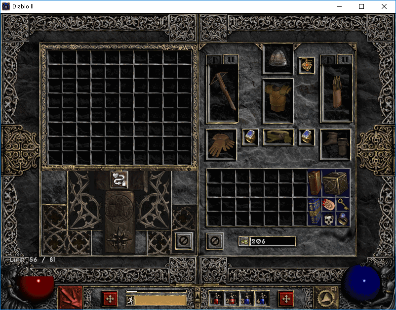
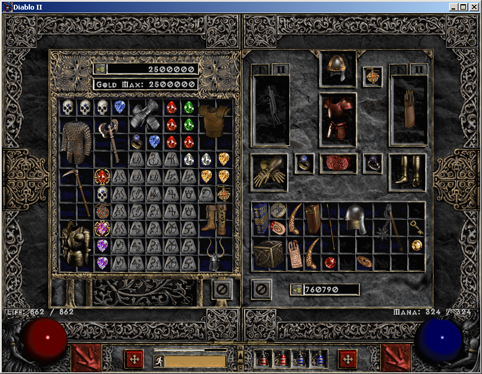
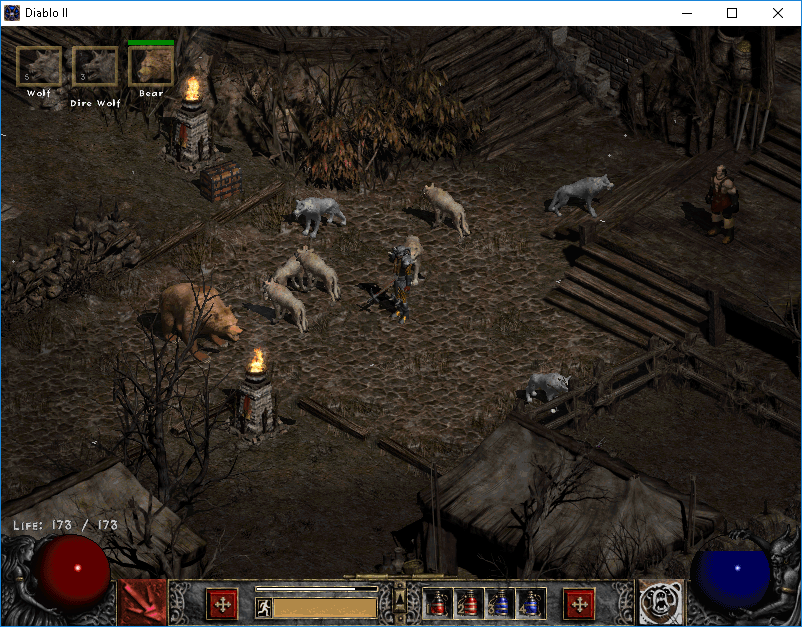
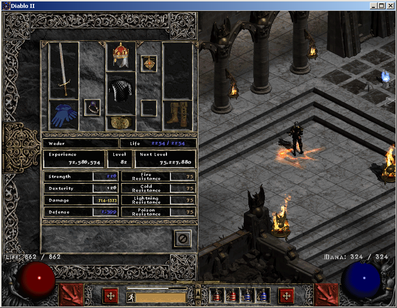
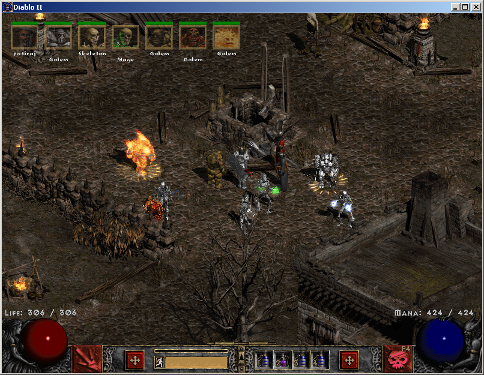
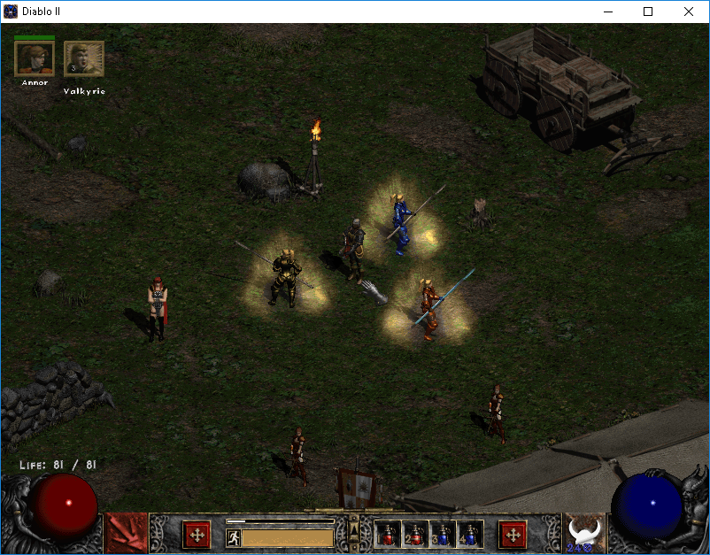

# Stay a while and listen!

This repository contains a collection of mods for the classic video game Diablo 2: Lord of Destruction.  The repository only contains soft mods which are simply text and image files that alter the game without any code changes.  Soft mods are highly compatible with different patches to the game.  These mods have been extensively tested with version 1.14c :wink:

Unlike other soft mods that I have seen, this one allows you to choose which features you want to use.

Also note, that once you apply these mods it is highly likely you will not be able to play in the offical game servers as they do not allow enhancements.  However, you should be able to run your own private game server with these enhancements.

## Requirements

Diablo 2 LoD versions 1.12 to 1.14d (May also work with earlier patches)

It is also advisable to remove any other enhancements or plugins as it may interfere with these mods.

## Usage
1) Download this repository and unzip into a folder. Use the 'Clone or download' button above or click [here](https://github.com/sajonoso/d2mods/archive/master.zip)
2) (Optional) By default all mods are enabled.  To disable any mods, open up the file d2_mods.js in a text editor and comment out any not required.  Save the changes before proceeding to step 2
3) Double click on the file d2_mods.js to generate the `data` folder.
4) Copy the generated data folder to your Diablo 2 installation folder.
5) Modify the shortcut you use to start the game by adding these two parameters: -direct -txt
6) Run the game and enjoy the new features.

## List of Mods

**Increased cube size**

This mod increases the Horadric cube size from 3x4 to 10x8


**Increased stash size**

This mod increases the default stash size from 6 x 8 to 10 x 10 slots, allowing you to collect more things.



**Add extra starter items**

This mod adds extra items when starting a new character

**Bear and wolves**

This mod allows summoning grizzly and wolves at the same time



**Extra Horadric Cube recipes**

This mod adds extra receipes to the Horadric Cube which will give you a small charm that adds skills from other characters.
The recipes are:
```
1 key + 1 town portal book -> Small charm (+1 teleport)

1 key + 1 stamina potion -> Small charm (+2 Valkyrie, +2 Decoy, +3 Grizzly, +3 Shadow Warrior, +3 Shadow Master)
1 key + 2 stamina potion -> Small charm (+12 Valkyrie, +12 Decoy, +12 Grizzly, +16 Shadow Warrior, +16 Shadow Master
1 key + 3 stamina potion -> Small charm (+30 Valkyrie, +30 Decoy, +30 Grizzly, +30 Shadow Warrior, +30 Shadow Master)

1 key + 1 thawing potion -> Small charm (+6 Clay, +6 Blood, +3 Iron, +3 Fire Golems)
1 key + 2 thawing potion -> Small charm (+10 golem mastery, +1 Iron Golem)
1 key + 3 thawing potion -> Small charm (+20 golem mastery, +1 Iron Golem)
```
The recipes requiring potions are designed to be used in different difficultly levels in the game.
```
1 potion = normal level
2 potion = nightmare level
3 potion = hell level
```


**Fixed font for number 5**

Updates the number 5 font so that it is easier to distinguish between 5 and 6.


**Fully equip hireling**

Add more bling to your hireling. By default the hireling allows a maximum of 4 items to be equiped (helm, armour, left and right hand).  In practice only three slots were used, as only one hireling could utilize all slots.  This mod allows the use of an additional 5 slots (amulet, ring, belt, gloves, and boots).  Only one ring is allowed but it can be added from either the left or right side.




**Multiple Golems**

If you are playing a Necromancer or have an item that allows you to summon golems, this mod will allow you to have one of each type of golem, instead of just one golem.  Create an army of minions to fight for you while you enjoy the scenery



**Multiple Valkyries**

Allows summoning more than one Valkyrie



## Future enhancements (To do List)

If time permits I may try the following:
* Make Amazon Decoy perform some action.  Maybe provide an aura or shoot fire at enemies
* Change one Barbarian and Paladin skill to allow summoning a minion
