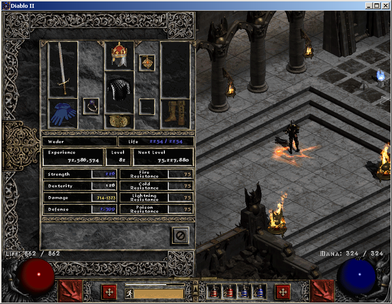
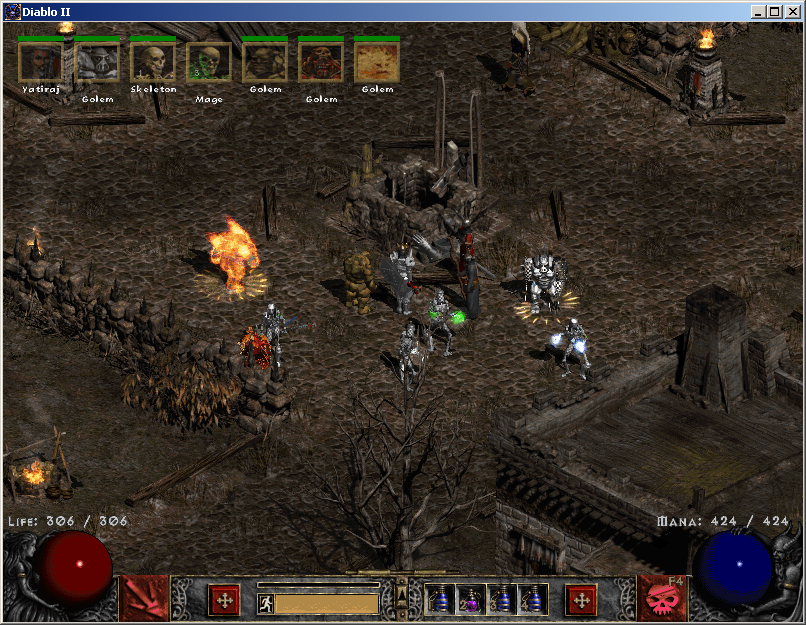

# Stay a while and listen!

This repository contains a collection of mods for the classic video game Diablo 2: Lord of Destruction.  The repository only contains soft mods which are simply text and image files that alter the game without any code changes.  Soft mods are highly compatible with different patches to the game.  These mods have been extensively tested with version 1.14c :wink:

The mods will not make you invincible but rather provide a better gaming experience by tweaking some features.  If you want to be invincible try a character editor instead.

Also note, that once you apply these mods it is highly likely you will not be able to play in the offical game servers as they do not allow enhancements.  However, you should be able to run your own private game server with these enhancements.

## Requirements

Diablo 2 LoD versions 1.12 to 1.14d (May also work with earlier patches)

It is also advisable to remove any other enhancements or plugins as it may interfere with these mods.

## Installation
Installing all the mods at once is simple.  These have been combined into the data folder in this project.  Simply copy the data folder into your Diablo II program folder.

Then modify the shortcut you use to start the game by adding these two parameters: -direct -txt

## Mods

**Fixed font for number 5**

Updates the number 5 font so that it is easier to distinguish between 5 and 6.

**Increased stash size**

This mod increases the default stash size from 6 x 8 to 10 x 10 slots, allowing you to collect more things.

**Fully equip hireling**

Add more bling to your hireling. By default the hireling allows a maximum of 4 items to be equiped (helm, armour, left and right hand).  In practice only three slots were used, as only one hireling could utilize all slots.  This mod allows the use of an additional 5 slots (amulet, ring, belt, gloves, and boots).  Only one ring is allowed but it can be added from either the left or right side.

**Multiple Golems**

If you are playing a Necromancer or have an item that allows you to summon golems, this mod will allow you to have one of each type of golem, instead of just one golem.  Create an army of minions to fight for you while you enjoy the scenery

## Future enhancements (To do List)

If time permits I may try the following:
* Make Amazon Decoy perform some action.  Maybe provide an aura or shoot fire at enemies
* Change one Barbarian and Paladin skill to allow summoning a minion
* Allow Druid to have Dire Wolf and Grizzly Bear at the same time
